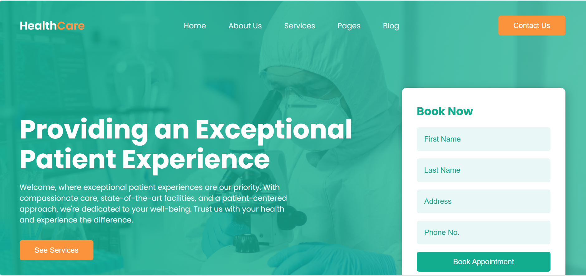

# 🏥 HealthCare – Medical & Healthcare Website  



**HealthCare** is a clean and professional **healthcare website** designed to provide users with essential medical information, services, and doctor profiles.  
The project focuses on **patient experience**, **service clarity**, and **trust-building design**.  
Built using **HTML** and **CSS**, it delivers a responsive and user-friendly interface suitable for hospitals, clinics, and healthcare providers.

---

## ✨ Features  

- 🏠 **Home Section** — Welcoming hero section with appointment booking form.  
- 🩺 **Services Section** — Highlights special medical services like lab tests, health checkups, and dentistry.  
- ℹ️ **About Us Section** — Provides detailed healthcare information and wellness guidance.  
- ⭐ **Why Choose Us Section** — Showcases key benefits like intensive care and free ambulance service.  
- 👨‍⚕️ **Doctors Section** — Displays specialist doctors with social media icons.  
- 📞 **Footer Section** — Includes contact details, services, and quick links.  
- 📱 **Responsive Design** — Optimized for all screen sizes.  

---

## 🖼 Demo  

👉 **Live Demo:** [Click Here](#)  

---

## 🛠️ Tech Stack  

- **HTML5** — semantic and structured markup  
- **CSS3** — responsive layouts and modern styling  
- **Remix Icon** — medical and social media icons  

---

## ⚙️ How to Use  

1. **Clone the repository**
   ```bash
   git clone https://github.com/fsafiya187/HealthCare.git

2. **Navigate to the project folder**

cd HealthCare

3. **Open the project**

Open index.html in your browser

---

## 📚 Learning Highlights

Designing a healthcare landing page.

Creating structured layouts using Flexbox.

Building responsive forms and sections.

Using icons to enhance UI clarity.

Developing user-friendly medical interfaces.

---

## 🧾 License

This project is open-source and available under the MIT License.

---

## 💬 Author

Safiya Fathima
🌐 GitHub: fsafiya187